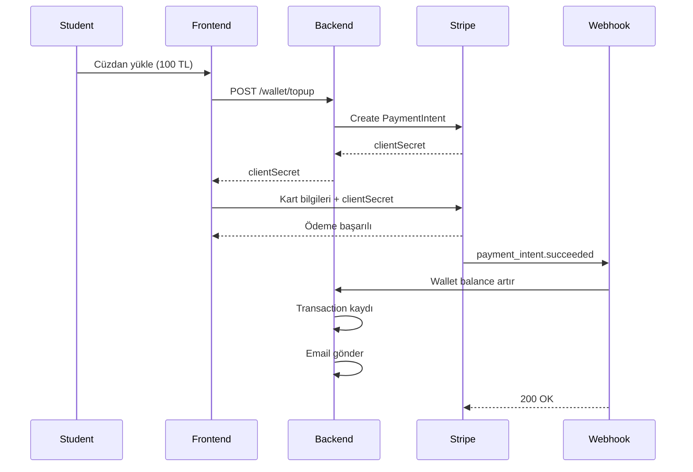

# 💳 Wallet Payment Integration Setup

## 📋 Environment Variables

`.env` dosyanıza aşağıdaki değişkenleri ekleyin:

```env
# Stripe (TEST MODE)
STRIPE_SECRET_KEY=sk_test_your_test_secret_key
STRIPE_PUBLISHABLE_KEY=pk_test_your_test_publishable_key
STRIPE_WEBHOOK_SECRET=whsec_your_webhook_secret

# Email (SMTP) - Optional
SMTP_HOST=smtp.gmail.com
SMTP_PORT=587
SMTP_USER=your-email@gmail.com
SMTP_PASS=your-app-specific-password
```

---

## 🔐 Stripe Test Mode Setup

### 1. Stripe Hesabı Oluştur
```
https://dashboard.stripe.com/register
```

### 2. Test API Keys Al
```
Dashboard → Developers → API Keys → Test Mode
```

**Test Keys:**
- `STRIPE_SECRET_KEY`: `sk_test_...`
- `STRIPE_PUBLISHABLE_KEY`: `pk_test_...`

### 3. Webhook Endpoint Oluştur

**Local Development için Stripe CLI:**
```bash
# Stripe CLI kur
brew install stripe/stripe-cli/stripe

# Login
stripe login

# Webhook forward (local)
stripe listen --forward-to http://localhost:3000/api/v1/wallet/topup/webhook
```

**Çıktıdan webhook secret'i kopyala:**
```
whsec_...
```

**Production için:**
```
Dashboard → Developers → Webhooks → Add endpoint
URL: https://your-domain.com/api/v1/wallet/topup/webhook
Events: payment_intent.succeeded, payment_intent.payment_failed
```

---

## 🧪 Test Credit Cards

Stripe test modunda şu kartları kullanabilirsiniz:

### ✅ Başarılı Ödeme
```
Card Number: 4242 4242 4242 4242
Expiry: Gelecekteki herhangi bir tarih
CVC: Herhangi 3 rakam
```

### ❌ Başarısız Ödeme (Yetersiz Bakiye)
```
Card Number: 4000 0000 0000 9995
Expiry: Gelecekteki herhangi bir tarih
CVC: Herhangi 3 rakam
```

### 🔐 3D Secure Gerekli
```
Card Number: 4000 0027 6000 3184
```

**Daha fazla test kartı:**
```
https://stripe.com/docs/testing
```

---

## 🚀 API Endpoints

### 1. GET `/api/v1/wallet/balance`
**Cüzdan bakiyesini getir**

```bash
curl -X GET http://localhost:3000/api/v1/wallet/balance \
  -H "Authorization: Bearer YOUR_JWT_TOKEN"
```

**Response:**
```json
{
  "success": true,
  "data": {
    "balance": 150.00,
    "currency": "TRY"
  }
}
```

---

### 2. POST `/api/v1/wallet/topup`
**Ödeme intent'i oluştur**

```bash
curl -X POST http://localhost:3000/api/v1/wallet/topup \
  -H "Authorization: Bearer YOUR_JWT_TOKEN" \
  -H "Content-Type: application/json" \
  -d '{
    "amount": 100
  }'
```

**Response:**
```json
{
  "success": true,
  "message": "Payment intent created successfully",
  "data": {
    "clientSecret": "pi_xxx_secret_xxx",
    "paymentIntentId": "pi_xxx",
    "amount": 100,
    "currency": "TRY"
  }
}
```

**Frontend'de clientSecret kullanarak Stripe Elements ile ödeme alın.**

---

### 3. GET `/api/v1/wallet/transactions`
**İşlem geçmişi**

```bash
curl -X GET "http://localhost:3000/api/v1/wallet/transactions?type=deposit&limit=10" \
  -H "Authorization: Bearer YOUR_JWT_TOKEN"
```

**Response:**
```json
{
  "success": true,
  "count": 5,
  "data": [
    {
      "id": "uuid",
      "type": "deposit",
      "amount": "100.00",
      "balanceBefore": "50.00",
      "balanceAfter": "150.00",
      "description": "Wallet top-up via Stripe - Payment ID: pi_xxx",
      "createdAt": "2024-12-22T10:30:00.000Z"
    }
  ]
}
```

---

### 4. POST `/api/v1/wallet/topup/webhook`
**Stripe webhook (Internal)**

Bu endpoint Stripe tarafından çağrılır. Manuel test için:

```bash
stripe trigger payment_intent.succeeded
```

---

## 🎯 Payment Flow



---

## 📧 Email Notification

Ödeme başarılı olduğunda otomatik email gönderilir:

**Gmail için App Password:**
1. Google Account → Security
2. 2-Step Verification aktif et
3. App Passwords → Generate
4. Şifreyi `.env`'e ekle

```env
SMTP_USER=your-email@gmail.com
SMTP_PASS=generated-app-password
```

---

## 🧪 Test Senaryoları

### Senaryo 1: Başarılı Top-Up

```bash
# 1. Login (Student)
POST /api/auth/login
{
  "email": "student@kampus.edu.tr",
  "password": "password123"
}

# 2. Bakiye kontrol
GET /api/v1/wallet/balance
# Response: { balance: 20.00 }

# 3. Payment intent oluştur
POST /api/v1/wallet/topup
{
  "amount": 100
}
# Response: { clientSecret: "pi_xxx_secret_xxx" }

# 4. Frontend'de Stripe Elements ile ödeme
# Card: 4242 4242 4242 4242

# 5. Webhook gelir (otomatik)
# Wallet balance: 20.00 → 120.00

# 6. Bakiye tekrar kontrol
GET /api/v1/wallet/balance
# Response: { balance: 120.00 }

# 7. İşlem geçmişi
GET /api/v1/wallet/transactions
# Transaction görülür
```

### Senaryo 2: Minimum Tutar Kontrolü

```bash
POST /api/v1/wallet/topup
{
  "amount": 25
}

# Response: 400
{
  "success": false,
  "error": "Minimum top-up amount is 50 TL"
}
```

### Senaryo 3: Başarısız Ödeme

```bash
# Test card: 4000 0000 0000 9995 (Insufficient funds)
# Webhook: payment_intent.payment_failed
# Email: Ödeme başarısız bildirimi
# Wallet balance değişmez
```

---

## 🔧 Troubleshooting

### Webhook gelmiyor
```bash
# Stripe CLI'da listen aktif mi kontrol et
stripe listen --forward-to http://localhost:3000/api/v1/wallet/topup/webhook

# Logs kontrol et
tail -f logs/combined.log
```

### Email gönderilmiyor
```bash
# SMTP bilgileri doğru mu kontrol et
# Gmail: App Password kullan (normal şifre değil)
# Logs'da hata var mı bak
```

### Database transaction hatası
```bash
# PostgreSQL çalışıyor mu
docker ps | grep postgres

# Migration çalıştı mı
npm run db:migrate
```

---

## 📊 Database Schema

### transactions tablosu
```sql
SELECT * FROM transactions 
WHERE studentId = 'uuid' 
AND type = 'deposit' 
ORDER BY createdAt DESC 
LIMIT 10;
```

**Örnek kayıt:**
```
id: uuid
studentId: uuid
type: deposit
amount: 100.00
balanceBefore: 20.00
balanceAfter: 120.00
description: Wallet top-up via Stripe - Payment ID: pi_xxx
referenceId: pi_xxx
referenceType: stripe_payment
createdAt: 2024-12-22T10:30:00.000Z
```

---

## 🎨 Frontend Integration (React)

```javascript
import { loadStripe } from '@stripe/stripe-js';
import { Elements, CardElement, useStripe, useElements } from '@stripe/react-stripe-js';

const stripePromise = loadStripe('pk_test_your_publishable_key');

function TopUpForm() {
  const stripe = useStripe();
  const elements = useElements();
  const [amount, setAmount] = useState(100);

  const handleSubmit = async (e) => {
    e.preventDefault();

    // 1. Create payment intent
    const { data } = await api.post('/api/v1/wallet/topup', { amount });
    const { clientSecret } = data.data;

    // 2. Confirm payment
    const result = await stripe.confirmCardPayment(clientSecret, {
      payment_method: {
        card: elements.getElement(CardElement)
      }
    });

    if (result.error) {
      alert('Ödeme başarısız: ' + result.error.message);
    } else {
      alert('Ödeme başarılı! Bakiyeniz güncellendi.');
      // Refresh balance
    }
  };

  return (
    <form onSubmit={handleSubmit}>
      <input 
        type="number" 
        value={amount} 
        onChange={(e) => setAmount(e.target.value)}
        min="50"
      />
      <CardElement />
      <button type="submit">Yükle</button>
    </form>
  );
}

function App() {
  return (
    <Elements stripe={stripePromise}>
      <TopUpForm />
    </Elements>
  );
}
```

---

## ✅ Checklist

- [ ] Stripe hesabı oluşturuldu
- [ ] Test API keys alındı
- [ ] `.env` dosyasına keys eklendi
- [ ] Stripe CLI kuruldu (local test için)
- [ ] Webhook endpoint test edildi
- [ ] Email SMTP ayarları yapıldı
- [ ] Test credit card ile ödeme yapıldı
- [ ] Wallet balance arttı
- [ ] Transaction kaydı oluştu
- [ ] Email notification geldi
- [ ] Swagger docs kontrol edildi

---

## 🎉 Hazır!

**Stripe test modunda çalışıyor! Production'a geçmek için:**

1. Stripe'da **Live Mode** aktif et
2. Live API keys al
3. `.env`'de test keys'leri live keys ile değiştir
4. Production webhook endpoint ekle
5. KYC (Know Your Customer) doğrulaması yap

**TRY (Türk Lirası) için Stripe Türkiye hesabı gerekebilir.**

---

**Sorular için:** support@kampus.edu.tr

