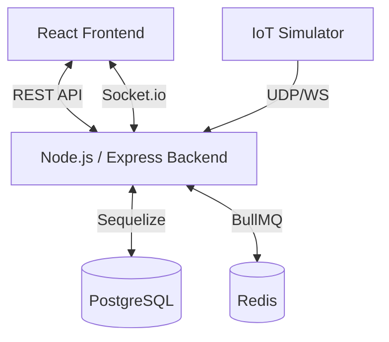

# System Architecture

## Architecture Diagram

## Layers
1. **Presentation Layer:** React.js, Material UI. Handles UI/UX.
2. **Business Logic:** Node.js Controllers & Services. Contains logic for attendance, notifications, etc.
3. **Data Layer:** PostgreSQL. Stores users, courses, sensor data.

## Key Components
- **Socket.io:** For real-time updates (Attendance count, Notifications).
- **Redis:** Used solely for BullMQ job queue (Background jobs).
- **Cron Jobs:** Scheduled tasks (Meal reminders).
